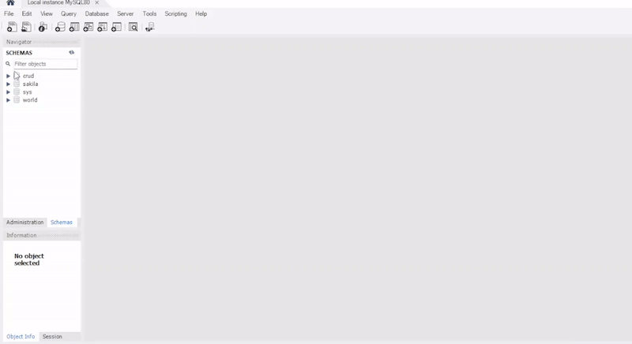

<h1 align="center">
    REACT LOGIN E DASHBOARD COM MYSQL E API
</h1>
<h3 align="center"> 
  🚧  Finalizado  🚧
</h3>

<p align="center">
  <a href="#-pré-requisitos">Pré-Requisitos</a>&nbsp;&nbsp;&nbsp;|&nbsp;&nbsp;&nbsp;
  <a href="#-configurando-banco-de-dados">Banco de Dados</a>&nbsp;&nbsp;&nbsp;|&nbsp;&nbsp;&nbsp;
  <a href="#-bibliotecas-usadas">Bibliotecas</a>&nbsp;&nbsp;&nbsp;|&nbsp;&nbsp;&nbsp;
  <a href="#-licença">Lincença</a>
</p>

## 💻 Projeto

Projeto com tela de login,register e Dashboard, utilizando MySQL e API'S


  
 ### ✅ Demonstração
 <p align="center">
   
</p>


### ⚙ Pré-requisitos

Antes de começar, você vai precisar ter instalado em sua máquina as seguintes ferramentas:
[Git](https://git-scm.com), [Node.js](https://nodejs.org/en/) e/ou [Yarn](https://yarnpkg.com/). 
Além disto é bom ter um editor para trabalhar com o código como [VSCode](https://code.visualstudio.com/) e 
instalado [MySQl::Workbench](https://www.mysql.com/products/workbench/).


### 🔧 Configurando Banco de Dados
 <p align="center">
  
</p>


### 📗 Rodando a Aplicação (web)

```bash
📗 Installation

Client
1. $ cd client
2. $ npm install 
  or $ yarn install
3. $ npm start 
 or $ yarn start

Server
1. Change your mySQL database data server/index.js
2. $ cd server
3. $ npm rum dev
```

## 🚀 Bibliotecas usadas

### Front-end
* react-chartjs-2s
* chart.js
### Back-end
* express
* mysql
* nodemon
* cors
* Formik
* bycrypt


### 📝 Licença

Esse projeto está sob a licença MIT.

<hr/>

Feito Por Hugo Nunes.
